<p align="center">
  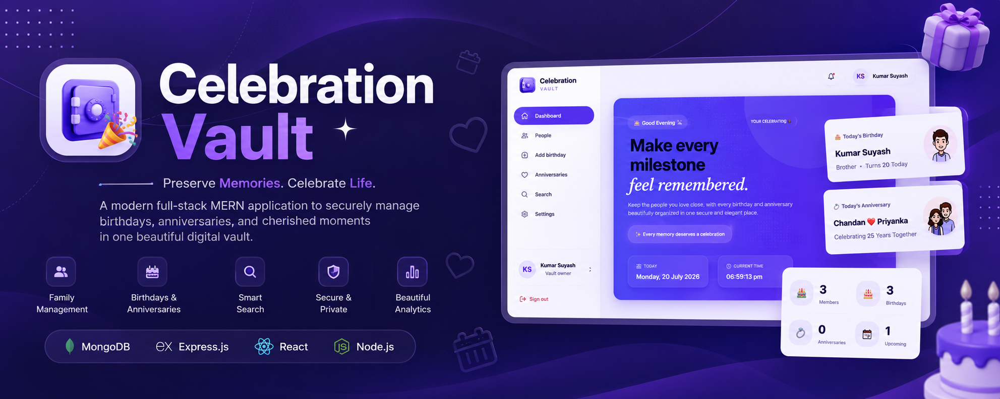
</p>

<h1 align="center">🎉 Celebration Vault</h1>

<p align="center">
A modern full-stack MERN application to securely manage birthdays, anniversaries, and cherished family memories in one beautiful digital vault.
</p>

<p align="center">
  ⭐ Preserve Memories • Celebrate Life • Never Miss a Special Moment ⭐
</p>

## 🌐 Live Demo

🔗 **Frontend:** https://celebration-vault.vercel.app

⚙️ **Backend API:** https://suyash99-arch-celebration-vault.onrender.com

📂 **Repository:** https://github.com/Suyash99-arch/celebration-vault

> **Note:** The backend is hosted on Render's free tier. The first request may take 30–60 seconds to wake up if the service has been idle.

# 🎉 Celebration Vault


<p align="center">


</p>

> Preserve memories. Celebrate moments. Share happiness.

Celebration Vault is a modern full-stack web application built using the MERN stack that allows users to securely store, organize, and revisit their special celebrations and memorable moments through a clean, responsive, and user-friendly interface.

---

## ✨ Features

- 🔐 Secure User Authentication
- 👤 User Registration & Login
- 🎉 Create and Manage Celebrations
- 📝 Store Personal Memories
- 📱 Responsive UI
- ⚡ Fast and Interactive Experience
- 🔒 Protected Routes
- 🌐 REST API Integration
- 💾 MongoDB Database
- 🎨 Clean and Modern Design

---

## 🛠 Tech Stack

### Frontend

- React.js
- HTML5
- CSS3
- JavaScript (ES6+)
- Vite

### Backend

- Node.js
- Express.js

### Database

- MongoDB
- Mongoose

### Other Tools

- Git
- GitHub
- VS Code

---

## 📂 Project Structure

```
celebration-vault/
│
├── frontend/
│   ├── src/
│   ├── public/
│   └── package.json
│
├── backend/
│   ├── controllers/
│   ├── models/
│   ├── routes/
│   ├── middleware/
│   ├── config/
│   └── package.json
│
└── README.md
```

---

## 🚀 Getting Started

### Clone the Repository

```bash
git clone https://github.com/Suyash99-arch/celebration-vault.git
```

### Install Dependencies

Backend

```bash
cd backend
npm install
```

Frontend

```bash
cd frontend
npm install
```

### Start Backend

```bash
npm run dev
```

### Start Frontend

```bash
npm run dev
```

---

## 📸 Screenshots

### Landing Page

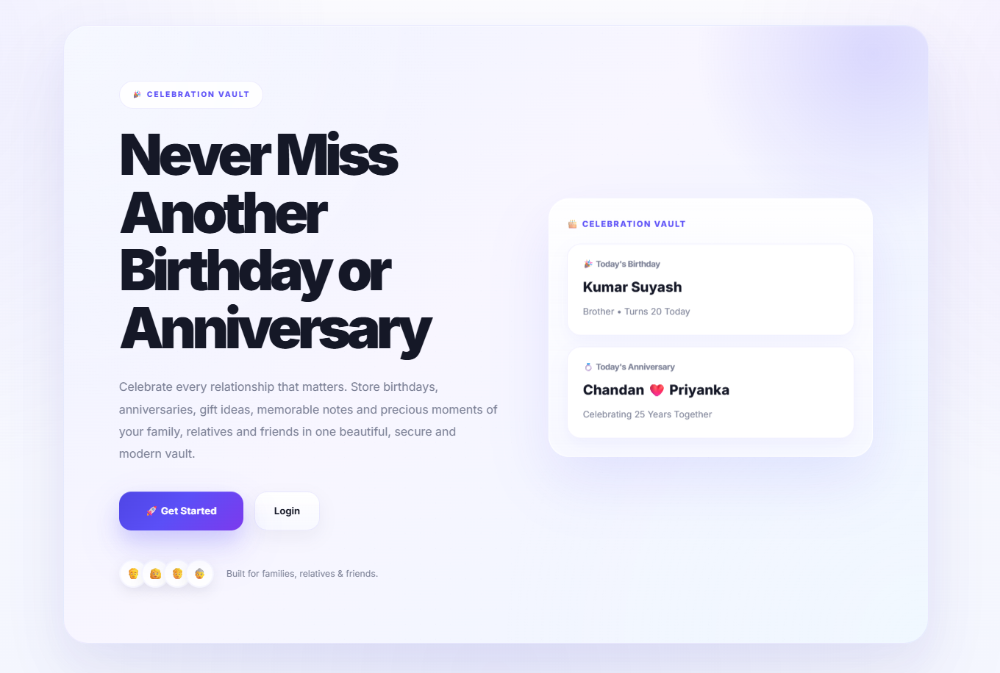
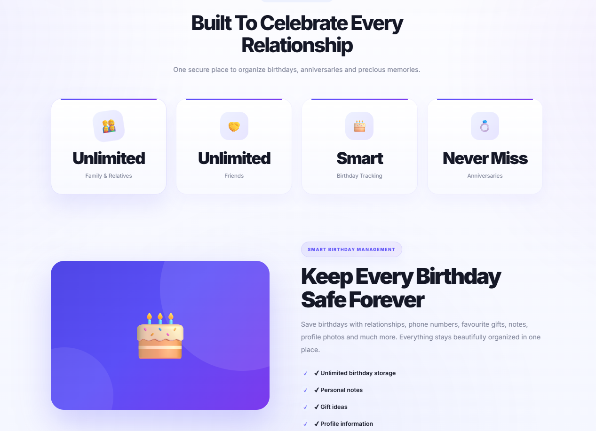
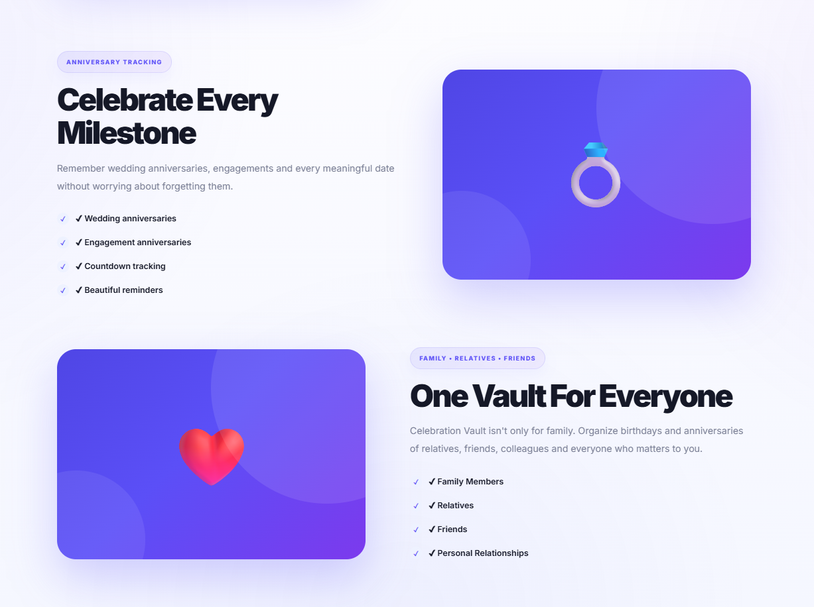
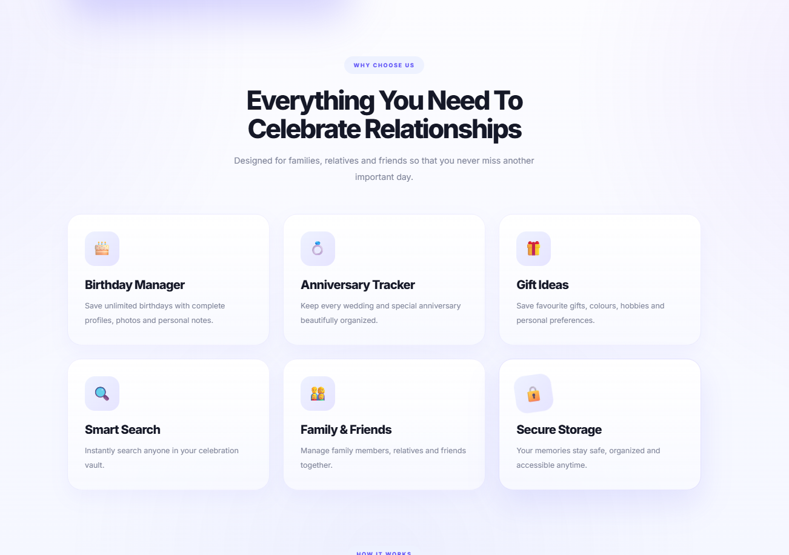
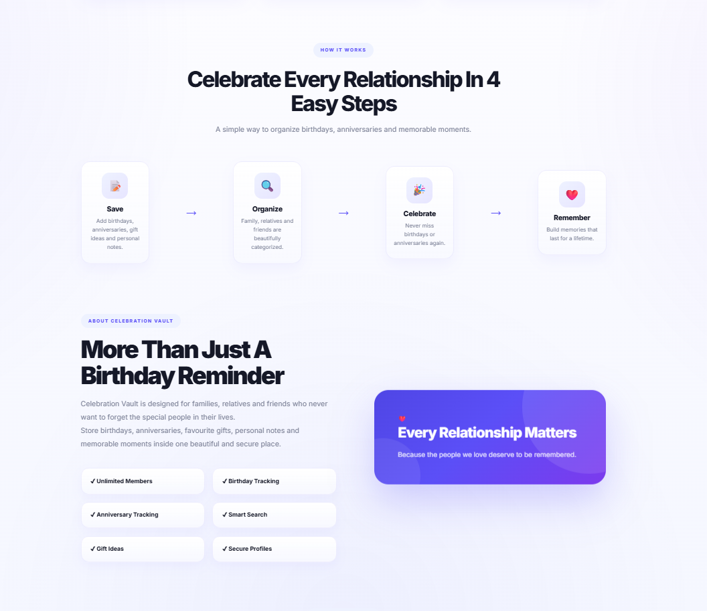
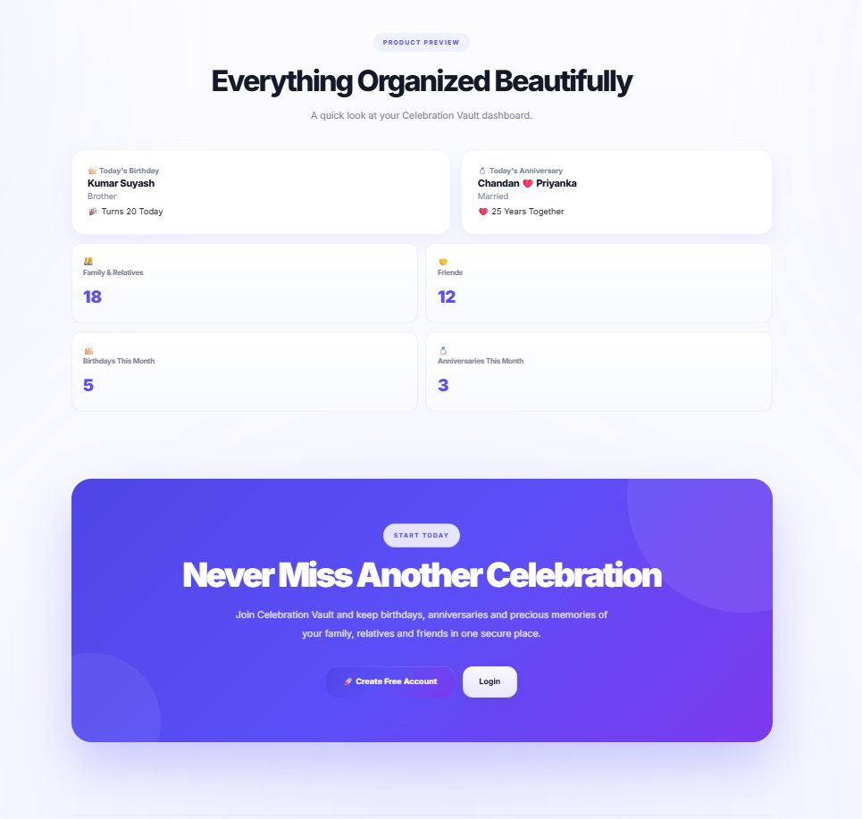

### Dashboard

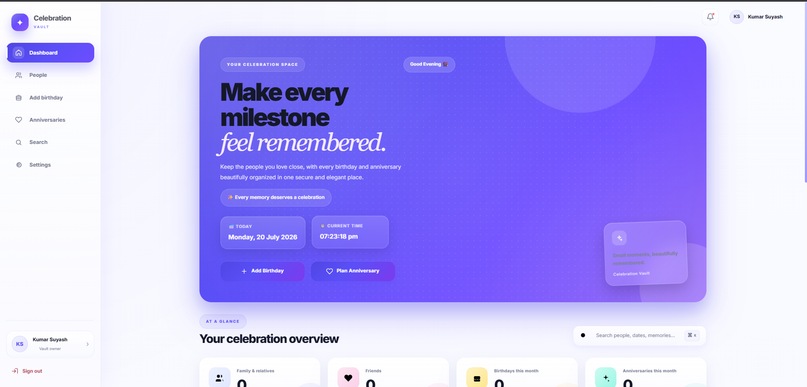
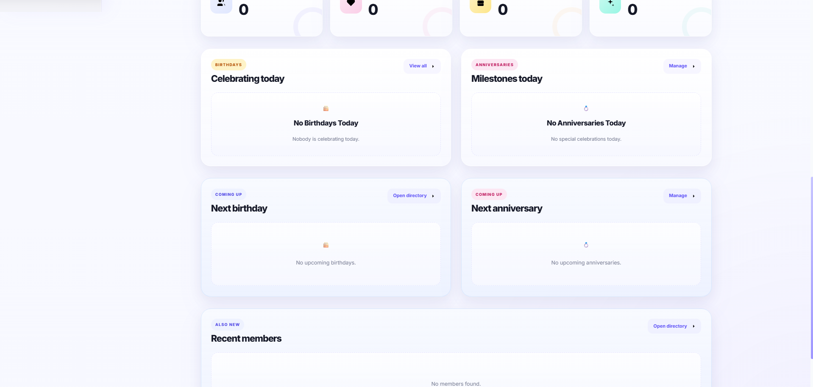

### Family Directory

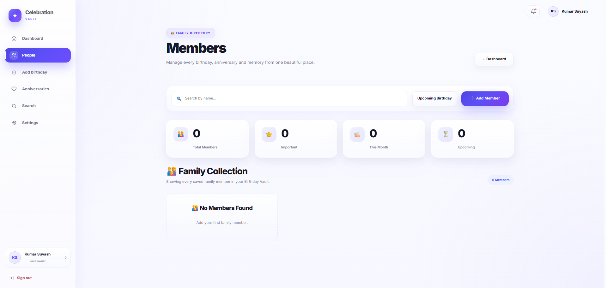

### Birthday Manager

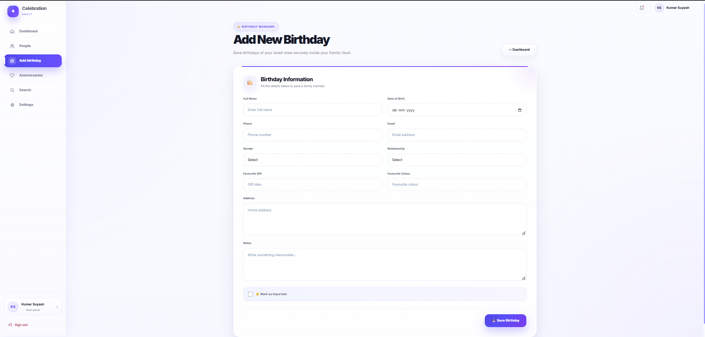

### Anniversary Manager

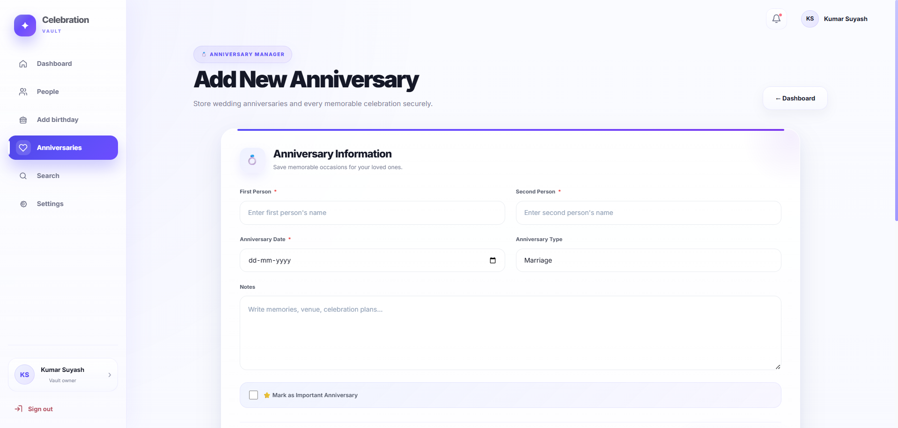
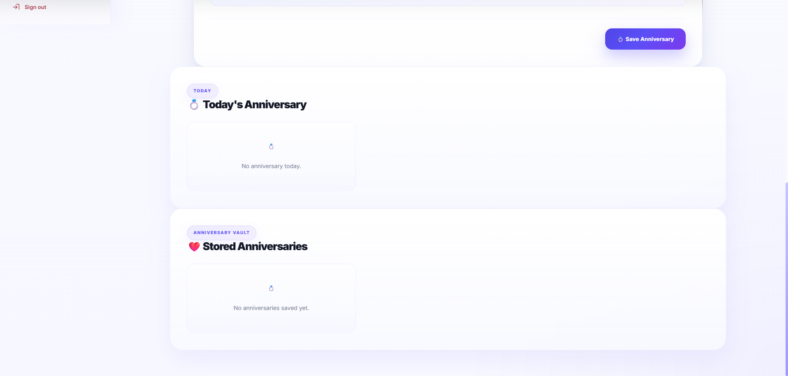

### Search

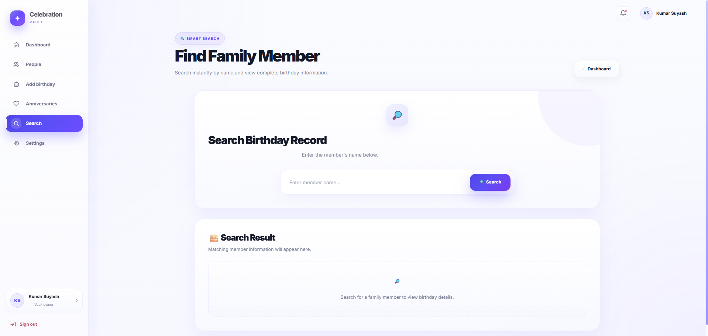

### Setting

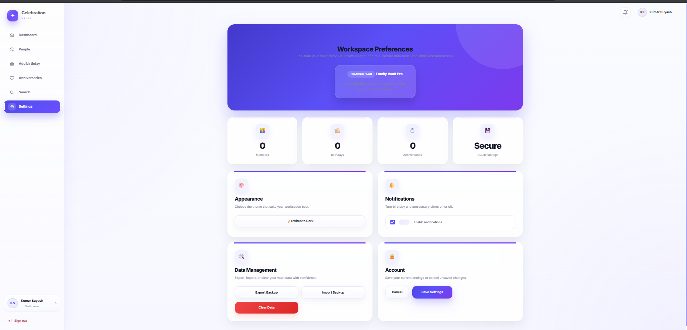

---

## 🔮 Future Improvements

- Email Notifications
- Image Upload Support
- Cloud Storage Integration
- Search & Filters
- Mobile App Version
- Dark Mode
- Admin Dashboard

---

## 🤝 Contributing

Contributions, issues, and feature requests are welcome.

Feel free to fork this repository and submit a pull request.

---

## 👨‍💻 Author

**Kumar Suyash**

B.Tech CSE (AI & ML)

KIET Group of Institutions

GitHub:
https://github.com/Suyash99-arch

LinkedIn:
(Add your LinkedIn profile here)

---

## ⭐ Support

If you like this project, please consider giving it a ⭐ on GitHub.

It motivates me to build more useful projects.

---

## 📄 License

This project is currently provided without an open-source license.

Please contact the author before reusing substantial portions of the code.

---

© 2026 Kumar Suyash. All Rights Reserved.
